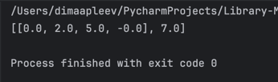
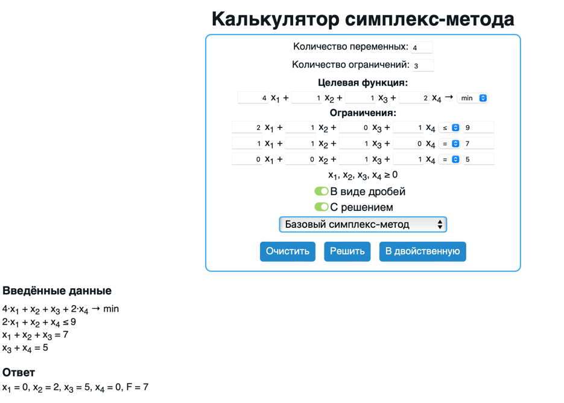

# Задание №1. Разработка программного обеспечения для решения задачи линейного программирования

## Ф.И.О.:

Аплеев Дмитрий Артурович


## Краткое описание механизма работы программы

Если описывать кратко, то процесс работы программы по решению ЗЛП можно разбить на следующие этапы:

1. Программа получает на вход txt-файл с записью ЗЛП в соответствующем формате.
2. Программа извлекает из txt-файла параметры ЗЛП, преобразуя их в нужный для обработки формат.
3. Приведение ограничений к стандартному виду: все `>=` умножаются на `-1` и становятся `<=`, равенства остаются в `A_eq`, неотрицательность `x >= 0` учитывается явно.
4. Формируется множество активных ограничений размера `n` (число переменных): все равенства плюс часть неравенств/границ `x_i = 0`. Для каждого набора решается линейная система, полученная из активных ограничений.
5. Найденная точка-кандидат проверяется на допустимость по всем ограничениям (с учетом допуска на численные ошибки).
6. Из всех допустимых кандидатов выбирается оптимальный по целевой функции (max или min).
7. При отсутствии допустимых вершин возвращается сообщение об отсутствии решения.


## Практическая демонстрация
Для проверки работы программы возьмем данные, соответствующие моему варианту лабораторной работы, и запишем их в текстовый файл 'task_lab1.txt' в определенном формате 
### Ответ программы: 
### Сравним полученные данные с ответами онлайн калькулятора:


## Что я понял?
Освоил реализацию альтернативного подхода к решению ЗЛП методом перебора вершин многогранника.

Разобрался, почему этот метод работает и как он связан с геометрией допустимой области.

Научился преобразовывать все типы ограничений (<=, =, >=) к стандартной форме для перебора.


## Инструкция по запуску

1. Установить Python 3.13  
2. Установить библиотеку:
   ```bash
   pip install numpy

3. Подготовь файл `task_lab1.txt`, записав в него ЗЛП в нужном формате. Файл должен находиться в одной директории с `lab1.py`.

4. Запустить программу:
    ```bash
    python lab1.py
   