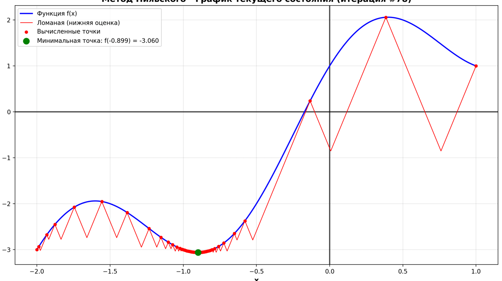
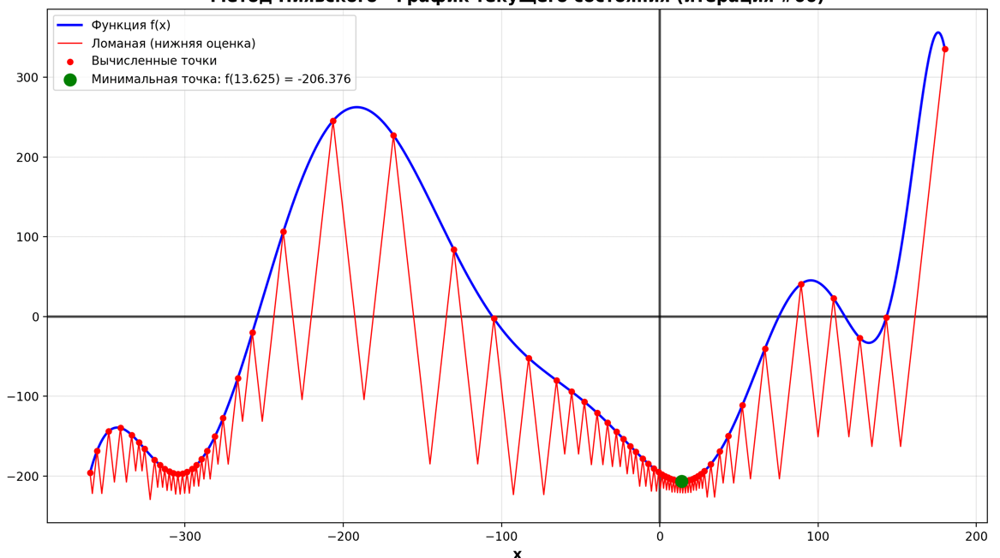
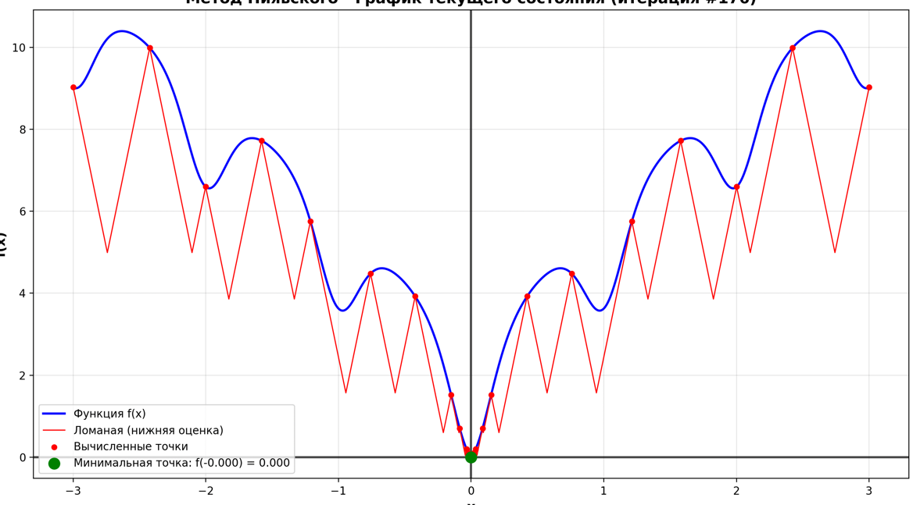
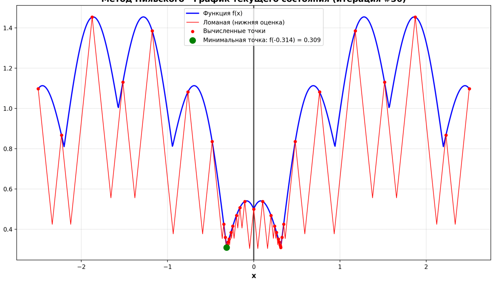
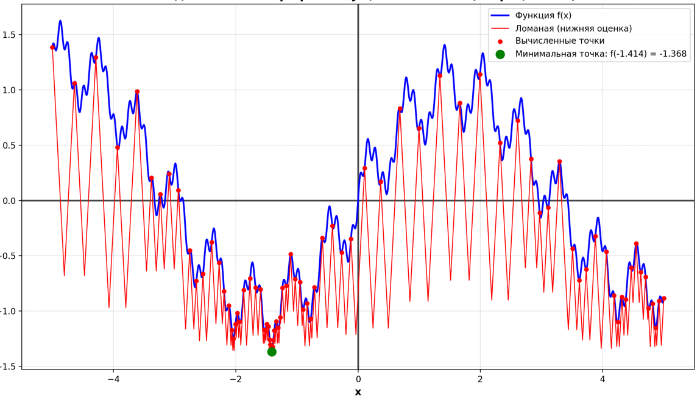

# Лабораторная работа: метод Пиявского для оптимизации одномерных функций

## Ф.И.О.:

Аплеев Дмитрий Артурович

## Метод Пиявского

Метод Пиявского (также известный как метод ломаных или метод Strongin) — это глобальный метод оптимизации для нахождения минимума липшицевых функций на заданном отрезке. Метод основан на построении ломаной линии (нижней огибающей), которая является нижней оценкой функции и позволяет гарантированно найти глобальный минимум.
## Описание реализации

### Класс `PiyavskyMethod`

Основной класс для реализации метода Пиявского содержит следующие методы:

#### `__init__(func, x_start, x_end, eps=0.01)`
**Инициализация класса:**
- `func`: строка с функцией (например, "f(x)=x+math.sin(x)")
- `x_start`: начало отрезка
- `x_end`: конец отрезка  
- `eps`: точность вычислений ( =0.01)

**Внутренние операции при инициализации:**
1. Преобразование строки функции в исполняемый код
2. Автоматический расчет константы Липшица методом численного дифференцирования
3. Инициализация начальных точек на границах отрезка
4. Создание кэша для хранения точек пересечения

#### `step() -> bool`
Выполняет одну итерацию метода Пиявского. Алгоритм шага:
1. Находит точку с наименьшим значением нижней оценки
2. Вычисляет значение функции в этой точке
3. Добавляет новую точку в список
4. Проверяет, достигнута ли требуемая точность

Возвращает `True`, если достигнута заданная точность, `False` - если еще нет.

#### `solve(max_iterations=10000) -> tuple[float, float]`
Запускает полный алгоритм оптимизации до достижения заданной точности. Возвращает координаты найденного минимума `(x_min, f_min)`.

#### `solve_for_iterations(target_iterations) -> tuple[float, float]`
Выполняет заданное количество итераций. Полезно для анализа поведения алгоритма на конкретной итерации или для демонстрации промежуточных результатов.

#### `plot(show_solution=True) -> None`
Визуализирует результаты работы алгоритма:
- Синий график: исходная функция
- Красная ломаная: нижняя оценка (ломаная Пиявского)
- Красные точки: вычисленные значения функции
- Зеленая точка: найденный минимум


#### `_get_L() -> float`
**Вычисляет константу Липшица L:**
1. Разбивает отрезок на 1000 равномерных точек
2. Использует центральную разность для численного вычисления производной
3. Находит максимальное абсолютное значение производной
4. Умножает на коэффициент 1.2 для обеспечения запаса надежности

## Результаты тестирования

### Тест 1: Простая функция
**Функция:** `f(x) = 2*x + cos(π*x) + sin(π*x)`  
**Отрезок:** [-2, 1]  
**Найденный минимум:** f(-0.899)=-3.060 
**Итераций:** 78  
**Время решения:** ~0.002 секунды

**Вывод:** Алгоритм быстро находит глобальный минимум на простой функции с одним выраженным минимумом.

### Тест 2: Сложная функция с множеством локальных минимумов
**Функция:** сложная тригонометрическая с модулями  
**Отрезок:** [-360, 180]  
**Найденный минимум:** f(13.625)=-206.376
**Итераций:** 66  
**Время решения:** ~0.003 секунды

**Вывод:** Метод эффективно работает на функциях с большим количеством локальных экстремумов, что демонстрирует его применимость для сложных задач.

### Тест 3: Функция Растригина
**Функция:** `f(x) = 10 + x² - 10*cos(2π*x)`  
**Отрезок:** [-3, 3]  
**Найденный минимум:** f(0.000) = 0.000  
**Итераций:** 28  
**Время решения:** ~0.001 секунды

**Вывод:** Алгоритм точно находит глобальный минимум функции Растригина, которая имеет множество локальных минимумов.

### Тест 4: Функция Экли
**Функция:** `f(x) = -20*exp(-0.2*√(x²)) - exp(cos(2π*x)) + 20 + exp(1)`  
**Отрезок:** [-3, 3]  
**Найденный минимум:** f(-0.0000000000000001) = 0.0000000000000004
**Итераций:** 176  
**Время решения:** ~0.008 секунды

**Вывод:** Для функции Экли потребовалось больше итераций, что связано с ее сложной структурой.

### Тест 5: Негладкая функция
**Функция:** `f(x) = |sin(x)| + 0.5*|cos(5*x)|`  
**Отрезок:** [-2.5, 2.5]  
**Найденный минимум:** f(-0.314)=0.309 
**Итераций:** 36  
**Время решения:** ~0.001 секунды

**Вывод:** Метод успешно работает с негладкими функциями.

### Тест 6: Мультимасштабная осциллирующая функция
**Функция:** `f(x) = sin(x) + 0.3*sin(10*x) + 0.1*sin(50*x) + 0.01*x²`  
**Отрезок:** [-5, 5]  
**Найденный минимум:** f(-1.414)=-1.368 
**Итераций:** 94  
**Время решения:** ~0.003 секунды

**Вывод:** Алгоритм эффективно справляется с функциями, имеющими осцилляции разных частот.


## Инструкция по запуску

1. Установить Python 3.13  
2. Установить библиотеки:
- numpy
- matplotlib
    ```bash
    pip3 install numpy matplotlib
3. Запустить программу:
    ```bash
    python lab2.py

## Заключение
Метод Пиявского служит эффективным инструментом для глобальной оптимизации одномерных липшицевых функций, принимая на вход строку функции, границы отрезка и требуемую точность. Алгоритм автоматически вычисляет константу Липшица, последовательно находит глобальный минимум с заданной точностью и визуализирует весь процесс оптимизации, включая график исходной функции, ломаную Пиявского, вычисленные точки и найденный минимум. Результаты работы содержат приближённые значения аргумента и функции, количество итераций и затраченное время. Ключевое преимущество метода это гарантированное нахождение глобального минимума для липшицевых функций, что делает его особенно ценным для задач, требующих именно глобальной, а не локальной оптимизации.