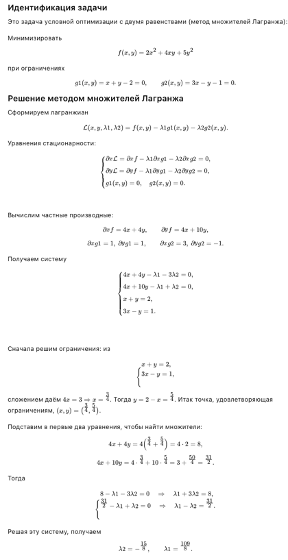
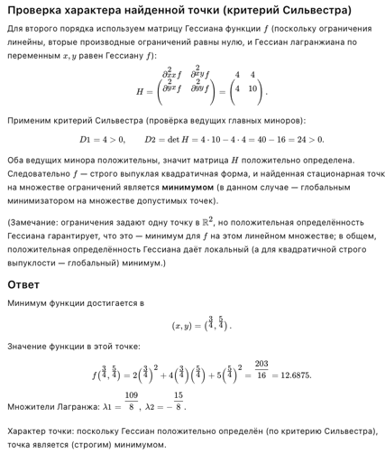

# Лабораторная работа: Задача условной оптимизации и БЯМ
## Ф.И.О.:

Аплеев Дмитрий Артурович
### Вариант 2
## Промпт для БЯМ
Ниже приведена задача условной оптимизации, которую требуется решить с помощью метода множителей Лагранжа. Она записана в Markdown формате. Пожалуйста идентифицируй задачу и реши её с помощью метода множителей Лагранжа. Проверь характер найденных точек с помощью критерия Сильвестра. 
Минимизировать $f(x,y)=2x^2+4xy+5y^2$ при $$ g_1(x,y)=x+y-2=0,\quad g_2(x,y)=3x-y-1=0. $$
## Ответ БЯМ

## Этапы решения задачи оптимизации

1. **Идентификация задачи**  
   Определяем, что перед нами задача минимизации функции двух переменных с двумя линейными ограничениями. Выбираем метод множителей Лагранжа для решения.

2. **Составление Лагранжиана**  
   Вводим функцию Лагранжа, которая объединяет целевую функцию и ограничения с помощью множителей Лагранжа. Это позволяет учитывать ограничения при поиске стационарной точки.

3. **Запись условий стационарности**  
   Выписываем условия, при которых градиент Лагранжиана по переменным равен нулю, вместе с выполнением ограничений. Получаем систему уравнений для переменных и множителей.

4. **Решение системы ограничений**  
   Сначала решаем только линейную систему ограничений, чтобы найти допустимую точку. Это упрощает дальнейшее решение системы.

5. **Нахождение множителей Лагранжа**  
   Подставляем найденные значения переменных в уравнения градиента Лагранжиана и решаем их, чтобы найти значения множителей Лагранжа.

6. **Проверка характера точки**  
   Строим матрицу вторых производных функции (Гессиан) и проверяем её положительную определённость с помощью ведущих миноров. Если матрица положительно определена, точка является минимумом.

7. **Вывод**  
   Определяем координаты точки минимума, значение функции в этой точке и соответствующие множители Лагранжа. Подтверждаем, что найденная точка действительно является минимумом на множестве допустимых точек.
## Итоги
Использование БЯМ заметно ускоряет решение задач и помогает не
застревать на технических деталях, но при этом не заменяет понимание теории.
В этой лабораторной работе модель дала корректное решение и помогла
лучше разобраться с методом множителей Лагранжа.