# Решение задачи динамического программирования  
Задача пошагового управления инвестиционным портфелем

---
## Ф.И.О.:

Аплеев Дмитрий Артурович
## 1. Цель работы и постановка задачи

**Цель работы** - познакомиться с методом динамического программирования при принятии решений в условиях неопределённости и применить его к задаче управления инвестиционным портфелем по критерию Байеса (максимальное математическое ожидание дохода).

**Задание:**

У инвестора есть три инструмента:

- ЦБ1 - первая ценная бумага;
- ЦБ2 - вторая ценная бумага;
- Деп. - банковский депозит.

К началу планового периода структура капитала (в денежном эквиваленте) такова:

- ЦБ1 - 100 д.е.;  
- ЦБ2 - 800 д.е.;  
- Деп. - 400 д.е.;  
- свободные средства - 600 д.е.

Общий начальный капитал составляет 1900д.e.

Период планирования разбит на три этапа (квартала).  
На каждом этапе возможно одно из состояний экономики:

- благоприятное;
- нейтральное;
- негативное.

Для каждого этапа заданы:

- вероятности состояний;
- коэффициенты изменения стоимости активов (во сколько раз умножается вложенная сумма).

Задача: **разработать план управления портфелем на 3 этапа**, то есть на каждом этапе выбрать один из трёх инструментов для вложения всего капитала, чтобы **максимизировать ожидаемый итоговый капитал**.

---

## 2. Общая математическая формулировка задачи динамического программирования

Рассмотрим общую постановку задачи динамического программирования в дискретном времени.

- \(t = 1, \dots, T\) – номер этапа;
- \(x_t\) – состояние системы на этапе \(t\);
- \(u_t\) – управлене (решение) на этапе \(t\);
- \(\xi_t\) – случайное воздействие (состояние среды) на этапе \(t\);
- \(f_t(x_t, u_t, \xi_t)\) – функция перехода: задаёт состояние \(x_{t+1}\);
- \(g_t(x_t, u_t, \xi_t)\) – прибыль/затраты на этапе \(t\);
- \(\Phi(x_{T+1})\) – терминальная прибыль.

Цель – максимизировать математическое ожидание суммарной прибыли:

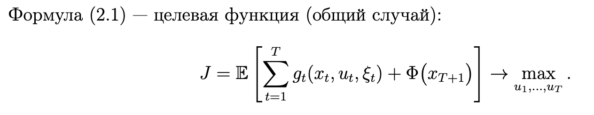

Введём функцию ценности:

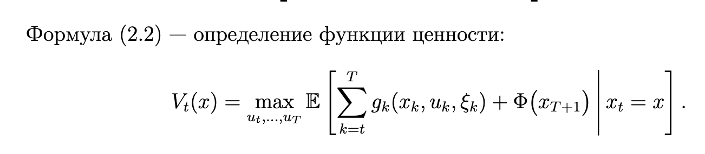

### Уравнение Беллмана (общий вид)

Базовое условие:

Рекуррентное соотношение Беллмана:

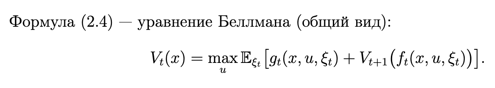

Это уравнение позволяет вычислять \(V_t(x)\) от последнего этапа к первому.

---

## 3. Рекуррентное соотношение Беллмана и схема решения

### Обозначения в общем случае

- \(V_t(x)\) – максимальное ожидаемое значение целевой функции, начиная с этапа \(t\) при состоянии \(x\);
- \(u_t^*(x)\) – оптимальное управление на этапе \(t\) в состоянии \(x\).

### Формула Беллмана

Ещё раз в компактной форме:

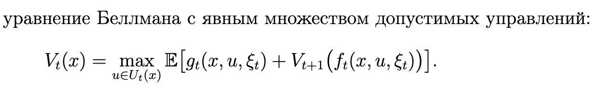

### Обратный и прямой проход

- **Обратный проход**  
  1. Задаём терминальное условие \(V_{T+1}(x)\).  
  2. Для \(t = T, T-1, \dots, 1\) и всех возможных состояний \(x\) вычисляем \(V_t(x)\) по формуле Беллмана.  
  3. Одновременно запоминаем оптимальные управления \(u_t^*(x)\).

- **Прямой проход**  
  Зная стратегию \(u_t^*(x)\) и стартовое состояние \(x_1\), можно пройти этапы вперёд, симулируя работу системы и получая траекторию состояний и значений целевой функции.

---

## 4. Конкретная постановка задачи и рекуррентное соотношение

### Обозначения

- \(t = 1, 2, 3\) – номер этапа (квартал);
- \(X_t\) – капитал в начале этапа \(t\);
- \(u_t \in \{\text{CB1}, \text{CB2}, \text{DEP}\}\) – выбранный актив на этапе \(t\);
- \(\xi_t \in \{\text{благоприятное}, \text{нейтральное}, \text{негативное}\}\) – состояние экономики на этапе \(t\).

Таблица вероятностей (по условию):

| Этап | p(Благопр.) | p(Нейтр.) | p(Негатив.) |
|------|-------------|-----------|-------------|
| 1    | 0.60        | 0.30      | 0.10        |
| 2    | 0.30        | 0.20      | 0.50        |
| 3    | 0.40        | 0.40      | 0.20        |

Таблица коэффициентов изменения стоимости активов \(a_{t,i}(\xi_t)\):
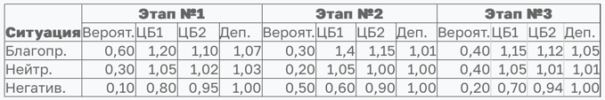
### Динамика капитала

Если на этапе \(t\) мы вкладываем весь капитал \(X_t\) в актив \(u_t\), то после реализации состояния экономики \(\xi_t\) капитал в конце этапа:

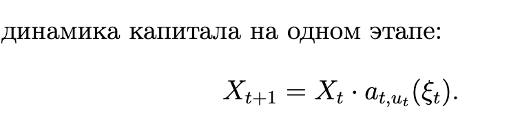

Начальное условие: \(X_1 = X_0 = 1900\) д.е.

### Целевая функция (критерий Байеса)

Итоговый капитал после 3 этапов:

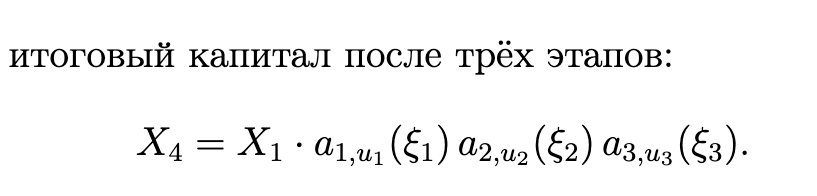

Нужно максимизировать **математическое ожидание**:

### Ожидаемые мультипликаторы

Для каждого этапа \(t\) и актива \(i\) вводим:

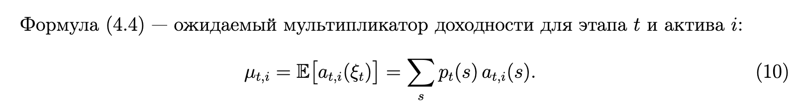

Расчёт даёт:

| Этап | μ(ЦБ1) | μ(ЦБ2) | μ(Деп.) |
|------|--------|--------|---------|
| 1    | 1.115  | 1.061  | 1.051   |
| 2    | 0.930  | 0.995  | 1.003   |
| 3    | 1.020  | 1.040  | 1.024   |

### Рекуррентное соотношение Беллмана для задачи

Поскольку прибыль зависит только от итогового капитала, удобно рассматривать функцию:

Для нашей модели выполняется линейность:

где \(k_t\) – коэффициент, зависящий только от этапа.

Подставляя в уравнение Беллмана, получаем:

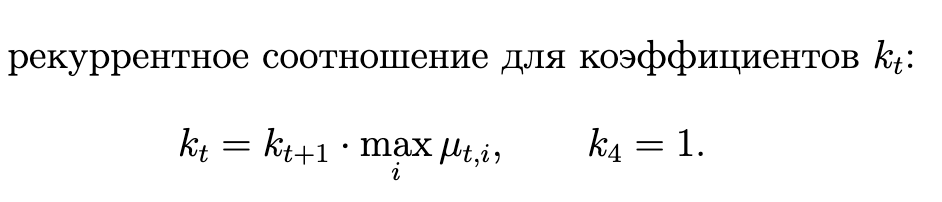

Отсюда:

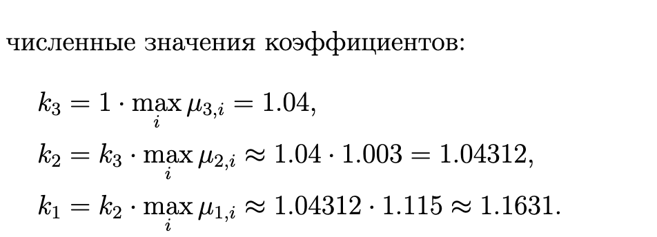

Оптимальный ожидаемый итоговый капитал:

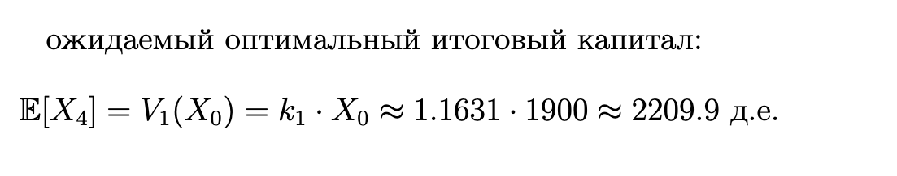

### Оптимальная стратегия

Из таблицы видно, какие активы дают наибольший ожидаемый коэффициент:

- этап 1 - **ЦБ1**;  
- этап 2 - **депозит**;  
- этап 3 - **ЦБ2**.

Таким образом логически оптимальный вариант это
ЦБ1 затем Депозит затем ЦБ2.

---
### 4. Результат
Ожидаемый капитал = best_factor[1] * X0

### 5.Схема решения

#### 1. Инициализация
- Задать начальный капитал X0
- Определить состояния экономики и вероятности P[t][s]
- Задать доходности Returns[t][a][s]

#### 2. Ожидаемые доходности
Для каждого этапа t и актива a:
μ[t][a] = Σ_s P[t][s] * Returns[t][a][s]

#### 3. Обратное ДП (уравнение Беллмана)
best_factor[T+1] ← 1.0

ЦИКЛ t от T до 1:
  Для каждого актива a:
    кандидат[a] ← μ[t][a] * best_factor[t+1]
  best_factor[t] ← max(кандидат)
  best_asset[t] ← argmax(кандидат)

#### 4. Результат
Ожидаемый капитал = best_factor[1] * X0

## 6. Демонстрационный вариант программы
При запуске скрипта выводится следующая информация:

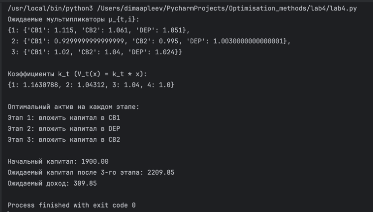

## 7. Выводы

В результате работы удалось на практике применить метод динамического программирования
к экономической задаче и закрепить понимание принципа оптимальности Беллмана.